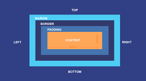

<h1 style="text-align:center;color:crimson;font-size:50px;">Notas CSS</h1>

## Fuentes
- [Midudev Curso CSS](https://www.youtube.com/watch?v=TlJbu0BMLaY)
- [Manz Dev](https://lenguajecss.com/)
- [Curso CSS Google](https://web.dev/learn/css?hl=es)

## Herramientas
- [Codi Link](https://codi.link/)
- [Can I Use, ver soporte de CSS](https://caniuse.com/)

## Contenido

- [Fuentes](#fuentes)
- [Herramientas](#herramientas)
- [Contenido](#contenido)
- [¿Donde poner los estilos?](#donde-poner-los-estilos)
- [Partes de CSS](#partes-de-css)
- [Colores](#colores)
  - [Current color](#current-color)
- [Selectores](#selectores)
- [Herencia](#herencia)
  - [¿Cómo se si hereda o no?](#cómo-se-si-hereda-o-no)
- [Pseudo-clases](#pseudo-clases)
- [Borde y Contorno](#borde-y-contorno)
- [first-child, last-child](#first-child-last-child)
- [Multilples selectores](#multilples-selectores)
- [Operador - Afectar por nivel `>`](#operador---afectar-por-nivel-)
- [Operador - Hermano siguiente `~`](#operador---hermano-siguiente-)
- [Operador - plus *(Inmediatamente despues)* `+`](#operador---plus-inmediatamente-despues-)
- [Cascada](#cascada)
- [Fallbacks](#fallbacks)
- [Especificidad](#especificidad)
- [Unidades](#unidades)
  - [Absoultas](#absoultas)
  - [Relativas](#relativas)
- [Reset CSS y Normalize](#reset-css-y-normalize)
- [Modelo de la caja](#modelo-de-la-caja)
  - [Padding](#padding)
  - [Border](#border)
  - [Margin](#margin)
  - [Box-Sizing](#box-sizing)
- [Overflow](#overflow)
  - [Soluciones?](#soluciones)
- [Position](#position)
  - [Absolute](#absolute)
  - [Relative](#relative)
  - [Fixed](#fixed)
  - [Sticky](#sticky)
- [z-index](#z-index)
- [Flexbox](#flexbox)
  - [¿Cómo le cambio de filas a columnas o vice-versa?](#cómo-le-cambio-de-filas-a-columnas-o-vice-versa)
  - [Flex-wrap](#flex-wrap)
  - [¿Cómo controlo el espacio de los elementos flexibles?](#cómo-controlo-el-espacio-de-los-elementos-flexibles)
  - [¿Le puedo cambiar el orden a los elementos?](#le-puedo-cambiar-el-orden-a-los-elementos)
  - [Justify-content](#justify-content)
  - [Gap](#gap)
  - [Align-items](#align-items)
  - [Align-content](#align-content)
  - [Align-self](#align-self)
- [Grid](#grid)
  - [Unidad especial](#unidad-especial)
  - [Filas automáticas](#filas-automáticas)
  - [Grid-auto-flow](#grid-auto-flow)
  - [Propiedad repeat](#propiedad-repeat)
  - [Poner limites](#poner-limites)
  - [Column-gap / Row-gap](#column-gap--row-gap)
  - [Ejemplo con media query](#ejemplo-con-media-query)
  - [Bento-Grids](#bento-grids)
  - [Superponer elementos](#superponer-elementos)
  - [Grid-area](#grid-area)
  - [Alineación en línea de los elementos](#alineación-en-línea-de-los-elementos)
  - [Alineación en bloque *(arriba a abajo)*](#alineación-en-bloque-arriba-a-abajo)
- [Centrar un div](#centrar-un-div)
- [Animaciones y Transiciones](#animaciones-y-transiciones)
  - [Transiciones](#transiciones)
    - [transition-property](#transition-property)
    - [transition-timing-function](#transition-timing-function)
    - [Transition-delay](#transition-delay)
    - [SIMPLIFICADO](#simplificado)
    - [Accesibilidad](#accesibilidad)
  - [Animaciones](#animaciones)
    - [Pseudo-elemento](#pseudo-elemento)
    - [Pulse animation](#pulse-animation)
    - [animation-iteration-count](#animation-iteration-count)
    - [Mas propiedades](#mas-propiedades)
    - [Pausar el elemento](#pausar-el-elemento)
    - [Estado con animation-fill-mode](#estado-con-animation-fill-mode)
    - [RESUMIDO](#resumido)
    - [FPS *(Fotogramas por segundo)*](#fps-fotogramas-por-segundo)
    - [Animaciones del Scroll](#animaciones-del-scroll)
    - [Galeria de imagenes](#galeria-de-imagenes)
- [Desktop-first | Mobile-first](#desktop-first--mobile-first)
- [Nesting CSS](#nesting-css)
- [Caracteres especiales](#caracteres-especiales)

## ¿Donde poner los estilos?

Se recomienda ubicar dentro del head con link directo hacia los estilos. **La sintaxis permite ubicarlos donde uno quiere ya sean**:
- En linea
- En el body
- En el head sin link
- En el head con link

> [!NOTE]
> Existen estilos por defecto que vienen integrados con el navegador

```html
<!-- Versión dentro de head sin link-->
<style>
    selector {
        propiedad: valor; /*Declaración*/
    }
</style>
<!-- Recomendación -->
<link rel="stylesheet" href="ubicacion archivo css">
```

- [Regresar](#contenido)

## Partes de CSS

- **Selector:** Donde seleccionamos el **elemento** que queremos estilar
- **Propiedad:** A que atributo vamos a afectar del elemento
- **valor:** Que valor le pondremos al atributo

```css
selector {  
    propiedad: valor;
}
```

- [Regresar](#contenido)

## Colores

```css
h1 {
    color: red; /*Valores predeterminados para colores*/
    /*color: #000000 Versión hexadecimal*/
    /*color: #9fb Hexadecimal corto = #99ffbb*/    
    /*color: rgb(255,0,0 / 0.5) Versión rgb/a (para transparencia)*/
    /*color: hsl(360,0.75,0.5 / 0.5) Versión hsl/a (para transparencia)
    /*color: oklch(348, 83%, 1 / 0.5) nuevo: lightness, chroma, alpha, hue*/
    /*color: transparent*/
}
body { /*Afecta a todo el body*/
    background: green;
}
```

### Current color

El color se basa por defecto en el texto del **elemento padre**

```css
h1 {
    color: red;
    border-width: 3px;
    border-style: solid;
    /*border-color: currentColor (por defecto)*/
}
```

- [Regresar](#contenido)

## Selectores

Tipos:
- Por etiqueta
- **Por clase:** Se puede repetir
- **Por identificador:** Es único

Ejemplo:

```html
<h1>Hola</h1>
<h2 class='subtitulo'>Hola</h2>
<h2 class='subtitulo'>Hola2</h2>
<h3 id='seccion-title'>Hola3</h3>
```

```css
h1 {
    color: red;
}
.subtitulo {
    color: green;
}
#seccion-title {
    color: blue;
}
```

> [!TIP]
> Evitar usar muchos selectores con identificadores y elementos, el **objetivo** es reutilizar código

- [Regresar](#contenido)

## Herencia

Algunas propiedades se heredan del **elemento HTML**

```html
<article>
    <h1>Hola mundo</h1>
</article>
```

```css
article {
    color: red
}
```

Entonces el h1 tiene color de texto rojo, heredando el estilo de su padre **article**.

> [!TIP]
> La propiedad `font-family` aprovecha bastante esta propiedad para cargarla a todo el documento

Sin embargo, podremos forzar la herencia

```html
<div class="container">
    Este es el container
    <div class="child">
        hola bros
    </div>
</div>
```

```css
.container {
    color: #09f;
    font-size: 32px;
    border: 3px solid #09f
}
.child {
    /*border: initial (default)*/
    /*border: unset (no heredables)*/
    /*border: revert (inherit default)*/
    border: inherit; /*Forzas herencia*/
}
```

> Es decir, ambos tendrían dos bordes con `inherit`.

### ¿Cómo se si hereda o no?

En [MDN](https://developer.mozilla.org/es/docs/Web/HTML) vas a la **formal definition** del elemento y ahí te índica si hereda o no.

- [Regresar](#contenido)

## Pseudo-clases

Los elementos HTML tienen un **estado** base en el que se encuentran. Con las `pseudo-clases` podemos atribuirle a los elementos ciertos estados como:
- `hover`: cuando pasemos el mouse por encima
- `active`: cuando damos clic *(en ese instante)*
- `focus`: en campos de entrada cuando le ponemos el focó *(estamos dentro)*
- `disabled`: cuando este deshabilitado el elemento
- etc
- [Doc pseudoclases](https://developer.mozilla.org/es/docs/Web/CSS/Pseudo-classes)

En las herramientas de desarrollo podemos simular, en las opciones que muestran como por ejemplo `:hov`.


- [Regresar](#contenido)

## Borde y Contorno

La diferencia es que el borde es algo que **afecta al contenido** y el contorno es algo que se esta dibujando **encima del contenido**

```css
link {
    border: 100px solid red;
    outline: 100px solid red;
}
```

- [Regresar](#contenido)

## first-child, last-child

Es una [pseudo-clase](#pseudo-clases) que donde tengamos varios elementos como por ejemplo listas podamos afectarlos por su orden

```html
<ul>
    <li class="list-item">Item 1</li>
    <li class="list-item">Item 2</li>
    <li class="list-item">Item 3</li>
</ul>
```

En CSS podriamos hacer esto:

```css
.list-item:first-child{ /*Afectamos el primero*/
    color: red;
}
.list-item:last-child{ /*Afectamos el último*/
    color: orange;
}
```

- [Regresar](#contenido)

## Multilples selectores

Cuando queramos afectar varios elementos con el mismo estilo, podemos usar varios elementos separados por comas como un selector combinado, de esta manera, todos ellos tendran el estilo

```css
h1, p, a{
    color: purple;
    font-size: 30px;
}
```

De esta manera `h1, p y a` tendran `30px` de fuente con color `purple`.

- [Regresar](#contenido)

>## Selectores combinados

Cuando queramos dar mas especificidad al selector, donde queramos afectar a cierto elemento dentro de cierto elemento podemos hacerlo mediante `>` que significa **conteniendo a**.

```css
.description .bold {
    color: #09f
}
```

De esta manera le decimos que las clases `bold` que esten **dentro** de la clase `description` tengan ese determinado estilo.

- [Regresar](#contenido)

## Operador - Afectar por nivel `>`

**Pero,y si quiero que se afecte por niveles?**

Digamos tenemos una lista dentro de otra:

```html
<ul> <!--Primer nivel-->
    <li>Item 1</li>
    <li>Item 2</li>
    <li>
        <ul> <!--Segundo nivel-->
            <li>Sub Item 1</li>
            <li>Sub Item 2</li>
        </ul>
    </li>
</ul>
```

Y queramos afectar al segundo nivel, podriamos hacerlo con el operador `>` para indicar cual es el nivel

```css
ul li { /*Afecta a ambas listas, la 2da recibe el doble de efecto*/
    opacity: 70%; 
}

ul li > ul li { 
    opacity: 70%
}
```

**¿Cuál es la diferencia?**

1. `ul li`: selecciona cualquier **li** que este dentro de un **ul**
2. `li > ul`: selecciona cualquier **ul** que sea **hijo directo** de **li**
3. `ul li`: selecciona cualquier **li** contenido en **ul**

Es decir, al final el efecto de opacidad solo afectará al 2do nivel

**Ejemplo 2:**

```html
<article>
    <p>Este es el contenido del artículo</p>
    <footer>
        <p>Escrito por midudev</p>
    </footer>
</article>
```

```css
article > p {
    color: red;
}
```

En este caso, solo los **p** que sean hijos directos de **article** serán afectados por el estilo 

- [Regresar](#contenido)

## Operador - Hermano siguiente `~`

```html
<article>
    <span>
        This is not red because it appears before any paragraph
    </span>
    <p>Paragraph</p>
    <span>
        This is red because it appears after any paragraph
    </span>
    <p>Paragraph</p>
    <span>
        This is red because it appears after any paragraph
    </span>    
</article>
```

```css
p ~ span {
  color: red;
}
```

Entonces cada `span` que aparezca despues de cada `p` tendrá los estilos, **NO antes de la p**.

- [Regresar](#contenido)

## Operador - plus *(Inmediatamente despues)* `+`

```html
<p>Hola</p>
<!-- Si pongo esto ya no se colorea el span <h1>h</h1> -->
<span>
    Hola 2
</span>
```

```css
p + span {
    color: red;
}
```

Donde solo los `span` que estan **inmediatamente despues** de cada `p` se verán afectados por el estilo

- [Regresar](#contenido)

## Cascada

```html
<p>
    Texto random
</p>
```

```css
p {
    color: #09f;
}
/*Pero*/
p {
    color: red;
}
```

Lo que pasa al final es que el color se pondrá **rojo**, porque la cascada de **CSS** aplicará el último efecto que se puso, se **sobreescribe**.

**¿Cómo lo decide?**

Por posición, en el orden de aparición

- [Regresar](#contenido)

## Fallbacks

A veces quieres usar algo moderno en **CSS**, pero no eta soportado en todos los navegadores, entonces para esos casos que podemos hacer:

```css
p {
    color: #09f;
    color: oklch(70% 0. 148 238.24);
}
```

Entonces con este truco, si no funciona el `oklch` le pone el `#09f`.

- [Regresar](#contenido)

## Especificidad

Algoritmo que determina que selector **CSS** tiene la **coincidencia** mas fuerte

```html
<p class="text>">Texto random</p>
```

```css
.text {
    color: #09f;
}

p {
    color: red;
}
```

Le pone el color azul, debido a que el selector de clase es de mayor importancia.

**¿Cuál es el orden de especificidad o el Algoritmo?**

Tenemos una [Calculadora de especificidad](https://specificity.keegan.st/)

Donde los niveles serían asi:

1. Si tienen `ID`
2. Si tienen `Clases, atributos o pseudo clases`
3. Los `elementos y pseudo elementos`

Estos niveles diran cuantos de dichos elementos hay y del primero al tercero van disminuyendo su importancia. Todo el selector suma todos los pesos de cada nivel y al final determina cual es puntaje total de importancia sobre otro selector.

> ej: si ambos tienen id, pero el otro tiene tambien el elemento, pues el que tiene `id+elemento` será el de mayor importancia.

> [!NOTE]
> Hoy en día existen **metodologías** de como nombrar las `clases` e `IDs` para evitar problemas de especificidad, tambien **frameworks** como [tailwindcss](https://tailwindcss.com/) que se encarga de ese tema en automático.

> [!WARNING]
> Los estilos no solo dependen del selector, tambien del **tipo de estilo**, es decir, un estilo **en linea** tiene mas especificidad que uno de un **archivo css**. Asi tambien es mas especifico el estilo del usuario que el navegador. 

> [!IMPORTANT]
> Puedes saltarte este tema de especificidad con la palabra clave `!important` en css despues de tu estilo `color: purple !important`. *Tener en cuenta que el important es otro nivel de especificidad de mayor importancia, porque si se tienen varios tambien se miraría cual de los dos important tiene mas especificidad (No se recomienda usar el important)*

- [Regresar](#contenido)

## Unidades

```html
<div class="containter"></div>
```

```css
div {
    width: 250px;
    height: 250px;
    background: red;
}
```

### Absoultas
Los **pixeles** no son unidades absolutas hoy en día, debido a que le densidad de pixeles por pulgada en las pantallas actuales ha cambiado *(dependera de la pantalla)*

### Relativas
- Tenemos **porcentajes**, dependeran del contenedor o elemento padre.
- Tenemos **em/rem**, dependeran del tamaño que tiene establecido el padre: si el padre es 16px, entonces `2em` serían 32px
- Tenemos **vw/vh**, dependeran del tamaño del `viewport`, es decir, tamaño de la pantalla.

- [Regresar](#contenido)

## Reset CSS y Normalize

Para poder resetear las hojas de estilo que introducían los navegadores **(A día de hoy no se recomienda, ya que puede eliminar estilos por defecto que pueden ser utiles)**, por tal motivo salió el `normalize`, como alternativa que buscaba renderizar todos los elementos de una forma consistente en todos los navegadores, pero sin la necesidad de resetearlos al completo, dejando unos por defecto que tengan sentido en todos los navegadores.

> Hoy en día muchos **frameworks** ya lo traen incorporado como [tailwindcss](https://tailwindcss.com/)

- [Regresar](#contenido)

## Modelo de la caja



Todos los elementos son cajas, unos funcionan en linea y otros en bloque.

- **linea**: da un salto de linea, el elemento por defecto es el `span`, todos los elementos de este tipo **se comportan como texto**, es decir, no tienen ni ancho ni alto. (Este efecto es una propiedad de css `display: inline`)
- **Bloque**: ocupa todo el espacio horizontal (propiedad de css `display: block`)

### Padding

Espacio alrededor del contenido, entre el contenido y el borde.

```css
section {
    width: 100px;
    padding: 16px 8px 4px 8px;
}
```

Los valores van desde arriba en el sentido de las manecillas del reloj, es decir, `arriba > derecha > abajo > izquierda`. Si ponemos solo **dos**, sería `arriba-abajo derecha-izquierda`, y si ponemos **una**, sería `todos`.

### Border

```css
section {
    width: 100px;
    padding: 16px;
    border: 10px solid red;
}
```

Este tambien afecta el tamaño de la caja, al final tanto `padding` como `border` afectan el tamaño de la caja y el `width` afecta al tamaño del contenido. En conclusión, tendremos un tamaño del ancho de la caja total de `100px + 32px + 20px = 152px`.

### Margin

```css
section {
    width: 100px;
    padding: 16px;
    border: 10px solid red;
    margin: 10px;
}
```

**No afecta el tamaño de la caja**, pero si separa la caja de los extremos.

### Box-Sizing

Una propiedad de css que por defecto esta en `content-box`, es decir, que el tamaño de la caja será el contenido de la caja. Pero para evitar este cálculo, podemos usar el valor `border-box`, lo que hará que el **alto** y el **ancho** si determinarán el tamaño total de la caja, haciendo que el `padding` y el `border` esten incorporados en esas propiedades.

> Tiene que ser congruente con las demas medidas para que el ajuste tenga sentido.

- [Regresar](#contenido)

---

## Overflow

```html
<section class="container">CSS IS AWESOME</section>
```

```css
.container {
    width: 150px;
    height: 150px;
    font-size: 48px; /*Muy grande*/
}
```

Al tener un **tamaño fijo** de una caja hace que si el contenido **llega a ser mas grande**, este se **desborda** (se sale).

### Soluciones?

Bueno, primero entender que esta funcionando con una propiedad por defecto `overflow: visible`, para solucionarlo deberiamos probar otros tipos de desbordamiento

```css
.container {
    width: 150px;
    height: 150px;
    font-size: 48px;
    overflow: hidden; /*Se recorta el contenido (como una mascara)*/
    /*overflow: scroll; Genera unas barras de desplazamiento para poder observar todo el contenido dentro de la caja*/
    /*overflow: auto; depende del navegador pone un desplazamiento con barras u otro tipo (RECOMENDADO)*/
}
```

> [!TIP]
> Tambien existen propiedades sobre el texto, si tenemos `hidden` y ponemos `text-overflow:ellipsis`, hace que la parte que no alcance a salir en la caja le ponga `...` al final, **recortando lo que no alcanzo a salir**. `text-overflow:clip` es otro, pero este **recorta exacto con la caja**.

- [Regresar](#contenido)

---

> [!TIP]
> La barra del navegador tambien se puede estilar [Scrollbar Playground](https://lyqht.github.io/scrollbar-playground/), se recomienda solo en cajas internas

---

## Position

**¿Cómo funcionan las posiciones en CSS?**

Funcionan de manera estática, y se van apilando uno al lado o debajo del otro, la cual por defecto es `position:static`.

```html
<section>
    <div class="container">
        container
    </div>
</section>
```

```css
section {
    border: 5px solid #ccc;
    width: 250px;
    height: 250px;
    box-sizing: border-box;
}

.container {
    background #09f;
    width: 100px;
    height: 100px;
    /*position: static;*/
}

body {
    background: rgb(188, 228, 255);
}
```

### Absolute

> Relativa al documento

sin embargo tenemos mas opciones como `absolute`, podemos determinar sus coordenadas dentro del documento

```css
section {
    border: 5px solid #ccc;
    width: 250px;
    height: 250px;
    box-sizing: border-box;
}

.container {
    background #09f;
    width: 100px;
    height: 100px;
    position: absolute; /*Posicion respecto al doc*/
    /*
    lo movemos a la esquina superior derecha de la pantalla
    top:0;
    right:0 Tambien se puede %
    al final se sale de la caja :(
    */
}

body {
    background: rgb(188, 228, 255);
}
```

> [!TIP]
> Centrar un `div` con `absolute` es posible `top:0;left:0;bottom:0;right:0;margin:auto;` haciendo que tenga la misma medida hacia todos los lados y centrandose en el centro. **(Útiles para modales o dialogos)**. la siguiente configuración  `inset:0; margin:auto;` resume todo lo anterior.

### Relative

> Relativa al padre

Pero en ciertos casos queremos ubicarnos respecto a otro elemento, en este contexto tenemos `relative`, permitienonos movernos sobre un elemento y sin salirnos de él como el `absolute`.

```css
section {
    border: 5px solid #ccc;
    width: 250px;
    height: 250px;
    box-sizing: border-box;
}

.container {
    background #09f;
    width: 100px;
    height: 100px;
    position: relative;
    /*Ubicado en la esquina inferior izquierda de la caja*/
    bottom: 0;
    left: 0; 
}

body {
    background: rgb(188, 228, 255);
}
```

### Fixed

> Relativa a la pantalla

Similar al absolute, pero lo que hace es que siempre este en esa posición de la pantalla, es decir, si hacemos *scroll* serguiá en el mismo sitio, por lo que son relativas a la pantalla

```css
section {
    border: 5px solid #ccc;
    width: 250px;
    height: 250px;
    box-sizing: border-box;
}

.container {
    background #09f;
    width: 100px;
    height: 100px;
    position: fixed;
    top: 0;
    right: 0; 
}

body {
    background: rgb(188, 228, 255);
}
```

> [!TIP]
> Útil para ventanas flotantes de ayuda o soporte, barras de navegación o menús

### Sticky

> Relativo al contenedor y pantalla

Se va mantener en su posición del contenedor, sin embargo, si me desplazo hacia un lugar donde no se vea, el elemento se movera con por el contenedor para seguir previsualizandose, hasta que ya llegue al otro extremo del contenedor. *"Se mantiene pegado por la pantalla dentro del contenedor"*.

```css
section {
    border: 5px solid #ccc;
    width: 250px;
    height: 250px;
    box-sizing: border-box;
}

.container {
    background #09f;
    width: 100px;
    height: 100px;
    position: sticky;
    top: 0;
    right: 0; 
}

body {
    background: rgb(188, 228, 255);
}
```

- [Regresar](#contenido)

## z-index

Se refiere a las posiciones de los elementos uno sobre el otro, **similar al photoshop con las capas**, se le conoce como `Contexto de apilamiento`.

Para poder modificar cual capa esta en determinada posición podemos usar `z-index`.

```html
<section class="parent">
    <div class="container">
        container
    </div>
</section>
<section class="parent">
    <div class="container">
        container
    </div>
</section>
```

```css
section {
    border: 5px solid #ccc;
    width: 250px;
    height: 500px;
    box-sizing: border-box;
    position: relative
}

.container {
    background #09f;
    width: 150px;
    height: 150px;
    position: fixed;
    right: 0; 
    z-index: 10; /*posición del eje z/profundidad*/
}

body {
    background: rgb(188, 228, 255);
}
```

Se recomienda usar los números deforma controlada y necesario, es decir, no usar el `z-index:99999;`. Se puede realizar con variables.

> [!IMPORTANT]
> Para usar los `z-index`, es necesario crear los [conceptos de apilamiento](https://developer-mozilla-org.translate.goog/en-US/docs/Web/CSS/CSS_positioned_layout/Stacking_context?_x_tr_sl=en&_x_tr_tl=es&_x_tr_hl=es&_x_tr_pto=tc)

> Entre mas grande el valor del `z-index` mas arriba en las capas.

- [Regresar](#contenido)

---

## Flexbox

Con `display:block;` que por defecto lo trae el elemento `div` se realizan saltos de linea por elemento ocupando todo el espacio horizontalmente. Si tenemos `display:inline` serán como textos, uno al lado del otro *(no hay salto de linea, no hay ancho ni alto-solo texto)*.

**¿Qué es Flexbox?**

Entonces nace un tipo de `display` que establece como tiene que funcionar el contenedor respecto a sus hijos, es decir, que va a ser variable dependiendo de los hijos mediante el valor `flex`.

Entonces en el siguiente ejemplo al usar `flex` se ubicarán todas las cajas en la primera fila, **variando su tamaño dependiendo del contenedor**, es decir, si el contenedor es angosto, todas las cajas reduciran su ancho para caber equitativamente en su contenedor

**¿Por qué en una fila?**

Esto debido a que por defecto esta configurado como filas, esto se puede modificar a **columnas** tambien.

```html
<section class="parent">
    <div class="item">1</div>
    <div class="item">2</div>
    <div class="item">3</div>
</section>
```

```css
.parent {
    display: flex;
}

.item {
    border: 1px solid;
    opacity: .9;
    width: 100px;
    height: 100px;
    background: #09f;
    /*display: inline; lo vuelve como un texto*/
}

.item:first-child {
    background: yellow;
}

.item:last-child {
    background: red;
}
```

### ¿Cómo le cambio de filas a columnas o vice-versa?

Para ello usamos `flex-direction: row` por filas o `flex-direction: column` por columnas. Si le aplicamos el valor `column` ahora veremos una columna con las cajas en el ejemplo anterior.

> [!IMPORTANT]
> Flex es **unidireccional**, solo puedo trabajar o filas o columnas, no puedo trabajar ambas en el mismo contenedor.

Tambien se tienen los siguientes valores:
- `row-reverse`: En fila pero pone el contenido al reves, de derecha a izquierda.
- `column-reverse`: En columna pero pone el contenido de abajo hacia arriba.
- `flex`: dirección por defecto *(filas)*

- [flex direction docs](https://developer.mozilla.org/en-US/docs/Web/CSS/flex-direction)

> [!TIP]
> Tambien podemos darle la vuelta al contenido de derecha a izquierda usando `direction:rtl;`, tambien podemos ponerlo vertical *(columnas)* de izquierda a derecha con `writing-mode: vertical-lr`. **útil para ciertos idiomas**

### Flex-wrap

Si no existe suficiente espacio en el contenedor lo ajusta para que quepa, esto por defecto usa `flex-wrap: nowrap`. **Que forzadamente lo hace caber**.

**¿Pero si no quiero modificar el elemento?**

Para ello usamos `wrap`, este si el contenido se llega a **desbordar**, produce el salto de linea para no modificar los elementos

> [!NOTE]
> Se puede resumir con propiedad y valor en uno solo mediante `flex-flow: row wrap;`

### ¿Cómo controlo el espacio de los elementos flexibles?

En ciertos casos queremos hacer que los elementos a parte de que se apilen de determinada forma, **traten de ocupar todo el espacio que se tiene**. Esto por defecto lo mantiene al comienzo porque tenemos las siguientes propiedades:
- `flex-grow: 0`: los elementos NO crecen
- `flex-shrink: 1`: los elementos pueden reducir su tamaño a un tamaño más pequeño que su flex-basis
- `flex-basis: auto`: los elementos tienen un tamaño base en automático

> Todo lo anterior se resume con `flex: initial`

Entonces si lo ajustamos con en los hijos:

```css
.item {
    flex-grow: 1;
    flex-shrink: 1;
    flex-basis: auto;  
}
```

> Hará que el primero ocupe su tamaño y reduzcan los otros.

Y si le ponemos 0 a la base:

```css
.item {
    flex-grow: 1;
    flex-shrink: 1;
    flex-basis: 0;  
}
```

> Hará que todos los elementos tengan el mismo ancho

**¿Se puede resumir todo eso?**

Si, con `flex: 1;` tendríamos que los *elementos pueden crecer, pueden reducir su tamaño mas pequeño que el basis y con basis 0 el mismo espacio para todos*.

Ademas el `1`, índica una medida relativa de cuanto espacio ocupan los elementos. Es decir, si usamos en uno de los elementos `flex: 2`, el elemento ocupara el **doble de espacio**, y asi sucesivamente con los valores, 4 sería el cuadruple, 3 el triple, etc.

```css
.parent {
    display: flex;
}

.item {
    border: 1px solid;
    opacity: .9;
    width: 100px;
    height: 100px;
    flex: 1;
}

.item:first-child {
    background: yellow;
    flex: 2; /*El doble*/
}

.item:nth-child(2) {
    background: blue;
}

.item:last-child {
    background: red;
}
```

### ¿Le puedo cambiar el orden a los elementos?

Si, con `order` podemos indicarle que valor ocupe.

```css
.item:first-child {
    background: yellow;
    flex: 2; /*El doble*/
    order: 3; /*ahora aparecerá de terceras*/
}

.item:nth-child(2) {
    background: blue;
    order: 1; /*Ahora eres el primero*/
}

.item:last-child {
    background: red;
    order: 2; /*Ahora eres el segundo*/
}
```

> [!NOTE]
> Útil para evitar el uso de `javascript`, e.j. `drag & drop`, **sin embargo,** se recomienda que sea mas interactivo, ya que el orden inicial si debe venir bien establecido en el `HTML`, para que **semánticamente tenga sentido**. 

### Justify-content

> Para practicar [Flexbox Froggy](https://flexboxfroggy.com/)

**¿Cómo podría ajustar las cajas sin cambiarles su tamaño dentro de su espacio?**

Para poder posicionar tus cajas dentro del padre, es decir, estas cajas tambien tienen sus posiciones dentro del padre *(eje x,y)*, lo **mas importante** para hacer con flex es distribuir el espacio en el eje principal, es decir, **el eje definido en el flex sería el principal**.

Para poder distribuir las cajas podremos usar `justify-content` que con los valores:
- `center`: ubica las cajas al centro
- `space-around`: deje espacio equitativamente entre las cajas y deja espacio equitativo entre las cajas y los limites con el padre
- `space-between`: deje espacio equitativamente dentro de los elementos **(no hacia afuera de las cajas mas extremas)**
- `space-evenly`: similar al `space-around`, pero esté espacio es equitativo entre los elementos y los elementos con los límites con el padre
- `flex-start`: por defecto, al inicio todos apilados uno al lado del otro
- `flex-end`: al final, apilados uno al lado del otro

### Gap

A veces queremos tener control preciso de **separación entre los elementos**, para ello usamos `gap` y usamos como valor las diferentes unidades que se tienen.

```css
.parent {
    gap: 16px;
}
```

> Se posiciona a nivel del eje principal

### Align-items

**¿Cómo puedo centrarlo verticalmente?**

Para ello tenemos `align-items` que con su valor `center` podremos centrarlo dentro de su padre perpendicularmente, es decir, si esta `flex: row` entonces con `align-items: center` lo centraremos a su eje perpendicular, **las columnas** y vice-versa. En este caso tenemos los siguientes valores:

- `flex-start`: Los ítems se alinean al **inicio del eje cruzado** (por ejemplo, arriba).
- `flex-end`: Se alinean al **final del eje cruzado** (por ejemplo, abajo). 
- `center`: Los ítems se alinean al **centro del eje cruzado**.            
- `baseline`: Los ítems se alinean según su **línea base de texto**.                   
- `stretch` (default): Los ítems se **estiran para llenar** el contenedor (si no tienen altura fija).

> Se posiciona a nivel del eje perpendicular

### Align-content

Con `align-content` podemos distribuir el **espacio entre las filas** y tenemos los siguientes valores:

- `flex-start`:Las filas se agrupan al **inicio del contenedor**.
- `flex-end`: Las filas se agrupan al **final del contenedor**.                  
- `center`: Las filas se agrupan en el **centro del contenedor**.              
- `space-between`: Las filas se distribuyen con **espacios iguales entre ellas**.     
- `space-around`: Igual espacio arriba y abajo de cada fila.                         
- `space-evenly`: **Espacio igualado** entre filas y en los extremos (arriba/abajo). 
- `stretch` (default): Las filas se **estiran** para llenar el contenedor.                 

> Se posiciona a nivel del contenedor

### Align-self

Similar al `align-items`, pero a nivel individual, un solo elemento. **Para una excepción**.

- [Regresar](#contenido)

---

## Grid

> Filas y columnas, maquetar la web

- [Practicar Grid](https://cssgridgarden.com/)

Puedes crear cuadriculas, alterar su orden y superponer elementos *(sin usar `position:absolute`)*. Nos permite trabajar con los **dos ejes** a diferencia de [Flexbox](#flexbox).

```html
<section class="container">
    <div>1</div>
    <div>2</div>
    <div>3</div>
    <div>4</div>
    <div>5</div>
    <div>6</div>
    <div>7</div>
</section>
```

Para agregarlo usamos `display:grid` sobre el contenedor, de tal manera que todo su contenido usará grid. Y mediante:
- `grid-template-columns`: podemos indicarle la cantidad de columnas y sus medidas

```css
.container {
    background: lightsalmon;
    border: 3px solid black;
    border-radius: 10px;
    display: grid;
    grid-template-columns: auto 20px 100px; /*1era auto, 2da 20px y 3era 100px, auto es que lo define el navegador dependiendo del contenido*/
}
.container div {
    background: lightblue;
    border: 2px solid #09f;
    border-radius: 6px;
}
body {
    background: #ddd;
}
```

### Unidad especial

Las fracciones, nos permite **indicar el tamaño de las columnas de forma proporcional**, para ello usamos `fr`

```css
.container {
    grid-template-columns: 1fr 1fr; /*Cada una 50%*/
}
.container2 {
    grid-template-columns: 2fr 1fr; /*1era es el doble de la 2da*/
}
```

> [!NOTE]
> Tambien se pueden mezclar `1fr 100px`, en este caso el ancho de la primera sería `1fr = ancho del contenedor - 100px`.

> [!WARNING]
> Tambien existe el **desborde** con grid, es decir, se pueden salir del contenedor si no esta bien configurado

**¿Puedo tambien configurar las filas?**

Si, para ello usamos `grid-template-rows` y funcionaría de manera similar.

```css
.container {
    display: grid;
    grid-template-columns: 1fr 1fr;
    grid-template-rows: 100px 50px 30px 100px; /*4 filas con diferente altura*/
}
```

> [!IMPORTANT]
> La cuadricula **NO DEPENDE** de los elementos, es decir, puedes crear cuadriculas vacías

### Filas automáticas

Tambien tenemos `grid-auto-rows: 25px`, es decir, cuando la grid me cree filas quiero que automaticamente cada una me ocupe `25px` de alto.

Pero si hago algo asi:

```css
.container {
    display: grid;
    grid-template-columns: 1fr 1fr;
    grid-template-rows: 100px;
    grid-auto-rows: 50px;
}
```

Me crea una fila que ocupe `100px` y en el espacio siguiente me crea las filas que quepan con `50px`;

### Grid-auto-flow

Cuando algo no cabe lo genera en filas por defecto `grid-auto-flow: row`, pero lo podemos cambiar a `column`, otro sería `dense` que **rellena los huecos con los que se pueda**.

### Propiedad repeat

**Es necesario repetir el código?**, es decir, si quiero 100 columnas de 100px tengo que digitar lo mismo 100 veces? No, para ello tenemos la función `repeat(cantidad, medida)`

```css
.container {
    background: lightsalmon;
    border: 3px solid black;
    border-radius: 10px;
    display: grid;
    grid-template-columns: repeat(5, 1fr); /*5 cols 1fr c/u*/
    grid-template-rows: repeat(3, 100px); /*3 rows 100px c/u*/
}
.container div {
    background: lightblue;
    border: 2px solid #09f;
    border-radius: 6px;
}
```

Tambien puedo mezclarlo, es decir:

```css
.container {
    grid-template-columns: 25px repeat(3, 1fr) 10px; /*1 col de 25px y otras 3 de 1fr y otra col de 10px*/
}
```

Tambien con **Patrones**

```css
.container {
    /*Generar 25px 50px 25px 50px 25px 50px*/
    grid-template-columns: repeat(3, 25px 50px)
}
```

### Poner limites

En el caso que queramos poner limites a la grilla, podemos usar la función `minmax(min,max)`, donde le indicamos las medidas minimas y maximas para la grilla.

```css
.container {
    grid-template-columns: minmax(100px,1fr) 1fr 1fr;
    /*Las medidas minimas del ancho de la columna serán 100px y como máximo será 1fr (comportarse como una fracción max, en este caso 33% porque son 3 columnas)*/
}
```

### Column-gap / Row-gap

Separación entre columnas y filas.

```css
.container{
    column-gap: 16px;
    /*gap: 20px 14px; simplifica las dos*/
}
```

### Ejemplo con media query

```css
@media (width > 300px) {
    div {
        grid-template-columns: 1fr 1fr;
    }
}
@media (width > 600px) {
    div {
        grid-template-columns: 1fr 1fr 1fr;
    }
}
```

Si el ancho es mayor a `300px` se vuelve una grilla de 2 columnas.

**¿Se puede simplificar?**

Si, con `minmax()` y:
- `auto-fill`: ubica el número de columnas que ocupan el ancho mientras su ancho minimo cumpla el ancho minimo

```css
div {
    display: grid;
    grid-template-columns: repeat(
        auto-fill,
        minmax(200px, 1fr)
    );
}
```
- `auto-fit`: ubica todo el espacio del contenedor siempre que pueda. **(Se nota cuando hay menos resultados)**

```css
div {
    display: grid;
    grid-template-columns: repeat(
        auto-fit,
        minmax(200px, 1fr)
    );
}
```

### Bento-Grids

Combinar columnas y/o filas

```css
.container div:first-child {
    grid-column-start: 1;
    grid-column-end: 3;
    /*o con filas*/
    grid-row-start: 1;
    grid-row-end: 3;
    /*resumido*/
    grid-row-start: span 2;
}
```

> [!TIP]
> Con `span` le indicamos que ocupe cierta cantidad de filas o columnas, ademas de poder hacerlo tambien así `grid-row: 2 / 4;`

Ahora ese primer elemento ocupará las **dos primeras columnas (1,2)**. Tambien puedes ubicar que inicie desde donde quieras ejemplo `2 al 4`, etc.

> [!TIP]
> Para contar desde atras, podemos usar **números negativos** 

### Superponer elementos

Básicamente **ubicarlos en el mismo lugar**. 

### Grid-area

Poder asignar nombres a determinadas areas de grilla para mejorar la legibilidad, [documentation](https://developer.mozilla.org/en-US/docs/Web/CSS/grid-area)

```css
.conainer main {
    grid-area: content;
}
```

Entonces en el contenedor lo puedes definir de manera mas legible

```css
.container {
    display: grid;
    grid-template-areas:
        "header header header"
        "sidebar content content"
        "footer footer footer"
}
```

Con el `.` ponemos huecos.

### Alineación en línea de los elementos

Al igual que en [flex](#flexbox) acá tambien podemos alineas los elementos.

```css
.container {
    justify-items: normal; /*default similar al stretch*/
}
```

Tambien tenemos los siguientes valores:
- `center`: los centra dentro de su columna
- `start`: al inicio de la columna *(pa' la izquierda)*
- `end`: lo contrario de start

**Pero, ¿Puedo cambiar solo un elemento?**

Si, usando `justify-self` y aplicando los valores vistos. Para mas valores [documentación](https://developer.mozilla.org/en-US/docs/Web/CSS/justify-items)

### Alineación en bloque *(arriba a abajo)*

Para ello esta `align-items` y podemos usar los mismos valores que `justify-items`

> Podemos poner los dos al tiempo.

- [Regresar](#contenido)

---

## Centrar un div

```css
.container {
    justify-content: center;
    align-content: center;
}
```

Resumido:

```css
.container {
    place-content: center;
}
```

- [Regresar](#contenido)

---

## Animaciones y Transiciones

> Full CSS, **SIN JavaScript**

### Transiciones

**¿Cómo funcionan?**

Permiten cambiar un elemento de un **estado inicial** a un **estado final**.

```html
<div cass="pulser"></div>
```

```css
.pulser {
    width: 50px;
    height: 50px;
    background: #09f;
    border-radius: 50%; /*Circulo si ancho y alto son iguales*/
    position: relative;
}
/*Estado hover*/
.pulser:hover {
    scale: 2; /*Que se duplique*/
}

body {
    display: grid;
    place-content: center;
    min-height: 50vh;
}
```

Tambien podemos usar `width y height` para reescalarlo, solo que `scale` tiene la particularidad que solo hace el efecto visualmente, ya que internamente si mantiene su tamaño.

Tambien podemos alterar el tiempo de la animación con `transition-duration`, la cual recibe segundos o milisegundos. Esto generará un efecto visual mas suave para el usuario.

```css
.pulser {
    transition-duration: 500ms; /*1s o .5s o ms*/
}

.pulser:hover{
    scale: 2;
    background: purple;
    box-shadow: 0 0 10px purple;
}
```

> [!IMPORTANT]
> La `transition-duration` se pone como mínimo en el elemento, para hacer que el efecto se aplique normalmente y de reversa cuando sea en sentido contrario, si lo aplicamos sobre la pseudoclase **NO** se aplicará el efecto de reversa

#### transition-property

**¿Es necesario activar todas las propiedades de la pseudoclase?**

No, esto lo puedes configurar mediante `transition-property` donde por defecto usa como valor `all` y por eso todo se anima. pero podemos ponerle los siguientes valores:
- `none`: ninguna
- `scale`: que solo se anime la escala, **con el nombre de la propiedad**
- `background, scale`: mas de una, **similar a un selector**

> [!WARNING]
> Si usamos `all` podriamos tener problemas de rendimiento, **sobre todo si tenemos sombras**.

#### transition-timing-function

**¿La velocidad siempre es lineal?**

De un estado al siguiente comunmente usa velocidad lineal. Es la que viene por defecto con la propiedad  y su valor: `transition-timing-function: linear`

Pero esto lo podemos cambiar con los siguientes valores:
- `ease-in`: lento a rapido.
- `ease-out`: rapido a lento.
- `ease-in-out`: inicio lento, recorrido rapido y final lento.
- `ease`: similar al `in-out`, pero comienza ligeramente mas rápido

Tambien tenemos una **función que nos permite indicar cuantos pasos** tiene que hacer para terminar la transición, se llama `steps` y recibe los pasos de la transición:

```css
.pulser {
    transition-timing-function: steps(5)
}
```

> Divide la transición en los pasos usados, **cuantos mas pasos mas fluido**.

Tambien tenemos `cubic-bezier` que es una **función** que recibe 4 parámetros `x1, y1, x2, y2` permitiendonos personalizar la [curva bezier cubica](https://es.wikipedia.org/wiki/Curva_de_B%C3%A9zier).

> [!TIP]
> Con las herramientas de desarrollo podemos controlar eso para obtener algunas ya preestablecidas.

```css
.pulser {
    transition-timing-function: cubic-bezier(0.08, 0.95, 1 , 1.15)
}
```

#### Transition-delay

**¿En que momento comienza la transición?**

Inicialmente de inmediato, sin embargo, se le puedee asignar un tiempo de demora con `transition-delay: 1s;`.

#### SIMPLIFICADO

Para ello usamos `transition`, donde tiene diferentes valores y ordenes [transition documentation](https://developer.mozilla.org/en-US/docs/Web/CSS/transition).

```css
.pulser {
    /* Apply to 1 property */
    /* property name | duration */
    transition: margin-right 4s;

    /* property name | duration | delay */
    transition: margin-right 4s 1s;

    /* property name | duration | easing function */
    transition: margin-right 4s ease-in-out;

    /* property name | duration | easing function | delay */
    transition: margin-right 4s ease-in-out 1s;

    /* property name | duration | behavior */
    transition: display 4s allow-discrete;

    /* Apply to 2 properties */
    transition:
        margin-right 4s,
        color 1s;

    /* Apply to all changed properties */
    transition: all 0.5s ease-out allow-discrete;
    transition: 200ms linear 50ms;

    /* Global values */
    transition: inherit;
    transition: initial;
    transition: revert;
    transition: revert-layer;
    transition: unset;
}
```

**¿Qué podemos animar y que no?**

Para ello podemos ir a la [lista oficial](https://developer.mozilla.org/en-US/docs/Web/CSS/CSS_animated_properties) para ver que propiedades podemos usar.

> Si tiene un estado intermedio, se puede animar.

**Puedo hacer distintos tipos de duración en la animación?**

Si, para ello manejamos dos transiciones

```css
.pulser {
    width: 50px;
    height: 50px;
    background: #09f;
    border-radius: 50%;
    position: relative;
    transition: all 300ms ease-in-out; /*Estado final*/
}
.pulser:hover {
    scale: 2;
    background: red;
    box-shadow: 0 0 10px red;
    transition-duration: 1s; /*Estado inicial*/
}
```

#### Accesibilidad

Se pueden desactivar las animaciones con una `media query`, en casos donde se prefiera no usarlas por distintos contextos, como de salud, etc.

```css
@media (prefers-reduced-motion: reduce) {
    .pulser {
        transition: none;
    }
}
```

Entonces si en el **navegador** tenemos *configurado* en la accesibilidad que las animaciones esten reducidas, el navegador **omitira** estas animaciones, haciendo que pasen de un paso a otro sin tiempos de por medio, al instante.

> [!TIP]
> No es necesario ser tan agresivos con desactivarlas, podemos configurar diferentes formas como por ejemplo, las duraciones que sean mas largas *(hacerlas menos llamativas)*.

- [Regresar](#contenido)

### Animaciones

Nos permite animar elementos **sin tener que interactuar con ellos**, a traves de una secuencia de estados, gracias a unos `fotogramas clave (keyframes)`, donde seguido le ponemos el nombre de la animación, luego donde empieza `from` que contenga las propiedades, luego su final `to` con las propiedades. Y la ventaja es que es **reutilizable**. 

> [!IMPORTANT]
> Necesita invocarse con `animation` y definirse su tiempo `animation-duration` para que sepa cuanto tiene que durar el efecto. Ademas, de que **solo dura una vez** y luego de terminar vuelve a su estado inicial

```css
.pulser {
    width: 50px;
    height: 50px;
    background: #09f;
    border-radius: 50%;
    position: relative;
    /*invocando la animación*/
    animation: move;
    /*necesita el tiempo!!*/
    animation-duration: 3s;
}
@keyframes move {
    from {
        transform: translateY(0px);
    }
    to {
        transform: translateY(100px);
    }
}
body {
    display: grid;
    place-content: center;
    min-height: 50vh;
}
```

#### Pseudo-elemento

Un **pseudo-elemento en CSS** permite aplicar estilos a una parte específica de un elemento sin necesidad de modificar el HTML. Se escribe con **doble dos puntos (`::`)** seguido del nombre del pseudo-elemento.

**Ejemplo breve:**

```css
p::first-line {
  font-weight: bold;
}
```

Este estilo aplica **negrita** solo a la **primera línea** de cada párrafo (`<p>`).

**Otros pseudo-elementos comunes:**

* `::before` – Inserta contenido antes del elemento.
* `::after` – Inserta contenido después del elemento.
* `::first-letter` – Estiliza la primera letra de un texto.

#### Pulse animation

- `animation-name`: nombre animación
- `animation-timing-function`: similar al caso anterior para las aceleraciones de los pasos

Continuando con el ejemplo:

```css
.pulser {
    width: 50px;
    height: 50px;
    background: #09f;
    border-radius: 50%;
    position: relative;
    animation-name: pulse;
    animation-duration: 3s;
    /*Con que aceleración se reproduce la animación*/
    animation-timing-function: ease-in-out;
}
.pulser::after{ /*Esta justo despues*/
    content: '';
    position: absolute;
    width: 100%;
    height: 100%;
    top: 0;
    left: 0;
    background: #09f;
    border-radius: 50%;
    z-index: -1;
    animation-name:
}
@keyframes pulse {
    0% {
        opacity: 0;
    }
    50% {
        scale: 2;
        opacity: 40%;
    }
    100% {
        opacity: .6;
    }
}
body {
    display: grid;
    place-content: center;
    min-height: 50vh;
}
```

**Pero la animación solo ocurre una vez 😔, ¿Se puede repetir?**

#### animation-iteration-count

Cuantas veces se tiene que repetir la pelicula, donde con `animation-iteration-count` le decimos cuantas veces queremos que se reproduzca.

```css
.pulser::after{
    /*Ejemplo para 5 veces*/
    animation-iteration-count: 5;
    /*En bucle*/
    animation-iteration-count: infinite; /*Sin parar*/
}
```

De igual forma tambien tenemos `animation-delay` para **demorar** el inicio de la animación *(con segundos o milisegundos)*.

> [!NOTE]
> No es necesario el valor inicial **en algunos casos**, ya que el lo sabe por defecto con su elemento. *En casos que sea el mismo que tenga por defecto el elemento*

#### Mas propiedades

- `animation-direction:reverse`: que la animación vaya en sentido contrario
- `animation-direction:alternate`: cuando termine la animación, vaya en reversa y asi sucesivamente.
- `animation-direction:alternate-reverse`: similar que el anterior, **pero comienza en reversa**
- `animation-direction:normal`: valor por defecto

#### Pausar el elemento

Podemos usar `animation-play-state:paused;`, pero no puede ser muy versatil, otra opción ya sería con interactividad y `JavaScript`. Pero tambien podriamos usarlo con estados

```css
img:hover {
    animation-play-state: paused;
}
```

De esta manera cuando tengamos el *mouse* por encima, la animación se pausará.

**Novedad con estados**

Podemos tener integrado dentro de su elemento los estados con las ultimas versiones del CSS, usando `&` ya que el internamente lo reemplaza por el elemento.

```css
img{
    /*
    ...
    properties
    */
    &:hover {
        animation-play-state:paused;
        opacity: .7;
    }
}
```  

#### Estado con animation-fill-mode

Sin el **infinito**, cuando termina la animación vuelve a su estado inicial **sin importar los keyframes**. Pero, en esos casos queremos que no se devuelve, y para ello usamos `animation-fill-mode` con los siguientes valores:
- `none`: por defecto, no mantiene ningun estado
- `backwards`: usa el keyframe inicial
- `forwards`: quedarse al final *(frame final)*
- `both`: de estado inicial *(antes de la animación) * a final *(despues de la animación final)* **(recomendado)**

#### RESUMIDO

versión corta para lo anterior podemos usar `animation` [documentation](https://developer.mozilla.org/en-US/docs/Web/CSS/animation)

```css
img {
    animation: mover 2s linear 0s
    /* @keyframes duration | easing-function | delay |
    iteration-count | direction | fill-mode | play-state | name */
    animation: 3s ease-in 1s 2 reverse both paused slide-in;
    
    /* @keyframes duration | easing-function | delay | name */
    animation: 3s linear 1s slide-in;
    
    /* two animations */
    animation:
      3s linear slide-in,
      3s ease-out 5s slide-out;
}
```

#### FPS *(Fotogramas por segundo)*

`1s steps(10)` Serían 10 pasos por segundo, y asi sucesivamente.

---

> [!NOTE]
> En cuanto a rendimiento, **es recomendable** usar animaciones CSS en vez de JavaScript, vienen optimizadas por **GPU** y no impactan demasiado el rendimiento

---

#### Animaciones del Scroll

Animaciones que funcionan a traves del scroll

```html
<html>
    <div id="progress"></div>
    <!--Bastante extenso
    Pues pa' poder hacer scroll-->
    ...
</html>
```

Queremos hacer que esa barra se vaya haciendo mas grande conforme avanzo con el `scroll`

Usaremos algo nuevo llamado `animation-timeline`, que permite usar valores diferentes para la evolución de la animación *(ejemplo: cuanto se ve un elemento en el viewport)*, con valores como la función `scroll()`.

```css
body {
    margin: 0;
}
main {
    padding: 32px;
}
#progress {
    position: fixed;
    top:0;
    width: 0; /*Controlo el ancho*/
    background: red;
    height: 1em;
    animation: progress-grow auto linear;
    /*Va a ser auto ya que no tenemos un tiempo fijo
    Este será definido por la posición del scroll
    según vayamos avanzando*/
    animation-timeline: scroll(root block); /*scroll(elemento) | scroll bloque o linea (horizontal o vertical), al ser un div no es necesario block ya que viene con el por defecto*/
}
@keyframes progress-grow {
    to {width: 1} /*del 0 al 100 en el ancho según la pos. del scroll*/
}
```

---

#### Galeria de imagenes

En este caso usaremos `animation-range` que recibe dos valores por los ejes (x,y), permitiendonos controlar en que punto se debería acabar la animación tanto en x como en y, en este caso usaremos y, y de acuerdo a la posición en y terminará la animación y luego se mantendra:

```html
<h1>Curso de Animaciones</h1>
<!--Un chingo de imagenes-->

```

```css
body {
    background-color: black;
    margin: 0;
}
section {
    columns: 2; /*lectura arriba abajo, luego siguiente col*/
    padding: 16px 32px;
    column-gap: 32px;
}
section img{
    border-radius: 4px;
    width: 100%;
    height: auto;
    margin-bottom: 32px;
}

h1 {
    color: white;
    text-align: center;
    padding: 16px;
    margin: 0;
    width: 100%;
    position: sticky; /*pegado al inicio y luego se mantiene*/
    top: 0;
    animation: enhance-header linear both; 
    animation-timeline: scroll(root block)
    /*la animación tarda mucho mejor que sea mas rapida y
    luego se mantenga hasta el final del documento para
    corregirlo una forma sería la siguiente:*/
    animation-range: 0 200px; /*animación de 0 a 200px de scroll luego se mantiene.*/
}
/*Queremos que la nav bar cambie*/
@keyframes enhance-header {
    to {
        background: rgb(155 155 155 / .4);
        backdrop-filter: blur(5px); /*difuminar lo de atras*/
        font-size: 18px; /*No ocupe tanto la fuente*/
        color: black; /*pa' que se note con el fondo blanco*/
    }
}
```

**Ademas del scroll, que mas podemos usar?**

- Podemos usar el `view` que dependerá del viewport, si esta en el **viewport**, cambiar el efecto.

**Que las imagenes aparezcan con un fade-in!!**

Si usamos el `scroll()`, me aparecerían todas las imagenes de golpe, entonces que uso?, para ello nos sirve la función `view()`, que esta relacionado con cuando **esta visible el elemento**.

Pero tiene un problema ya que entonces cuando este arriba del todo se verá con 100 de opacidad, y queremos que se vea antes, para ello ajustamos el rango: `    animation-range: entry 20% cover 30%;` en este caso es, cuando el elemento haya mostrado un `20%` **empieza la animación** y cuando haya mostrado un `30%` **termina la animación**, haciendo el efecto mas rapido

> Recordar el `opacity` crea un `stacking-context` y debemos ajustar el `z-index`

```css
h1 {
    z-index: 1;
}

section img{
    border-radius: 4px;
    width: 100%;
    height: auto;
    margin-bottom: 32px;

    animation: reveal linear both; /*cuando termine se quede con el estado final*/
    animation-timeline: view();
    /*20% de imagen empieza-30% de imagen termina*/
    animation-range: entry 20% cover 30%;
}

@keyframes reveal {
    from {
        opacity: 0;
    }
    to {
        opacity: 1;  
    }
}
```

- [Regresar](#contenido)

## Desktop-first | Mobile-first

- `desktop-first`: Los diseños se realizan **principalmente** en desktop y se adaptan a mobile
- `mobile-first`: Los diseños se realizan **principalmente** en mobile y se adaptan a desktop

- [Regresar](#contenido)

## Nesting CSS

Puedes integrar **selectores** dentro de otro para asi evitar tener que escribir ese **selector** en especifico en otra linea. Para ello simplemente lo anidamos uno dentro de otro

```css
div {
    background-color: red;
    p {
        font-size: 20px;
    }
}
/*Es igual a */
div {
    background-color: red;
}

div p {
    font-size: 20px;
}
```

- [Regresar](#contenido)

## Caracteres especiales

Ciertos caracteres como `<` y `>` los podemos usar con una codificación [ASCII](https://ascii.cl/es/codigos-html.htm), ejemplo `< = &lt` y asi hay mas listas.

- [Regresar](#contenido)
